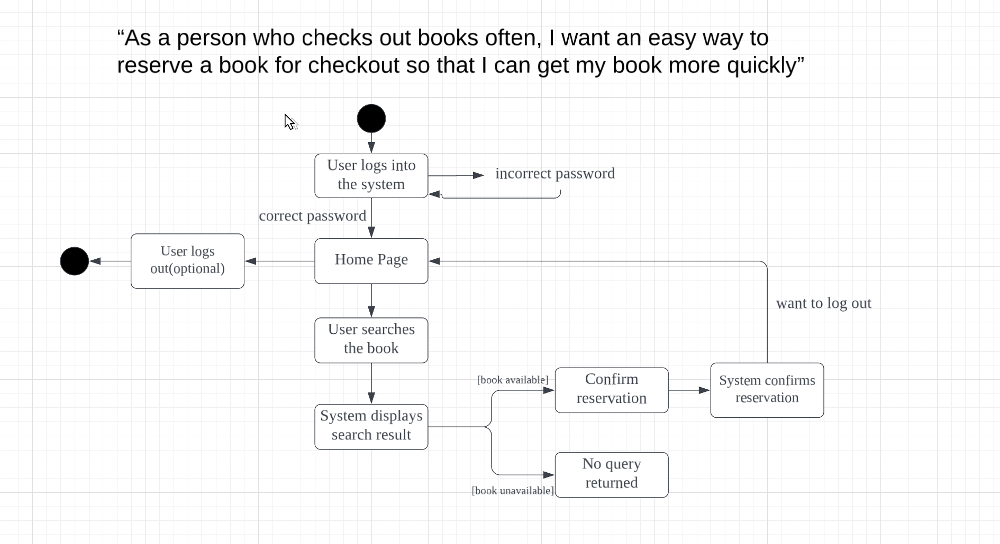

# Specification Phase Exercise

A little exercise to get started with the specification phase of the software development lifecycle. See the [instructions](instructions.md) for more detail.

## Team members

Darren Zou, Peter D'Angelo, Jack Zhang, Gene Park, and Joseph Chege

## Stakeholders

### Stakeholder 1: Finn, friend of Peter

#### Goals:
- Ease of returning books
- Clear dates for returning books/due dates for checked-out books
- Ease of finding book locations
- Reliable indicator of book availability

#### Problems:
- Difficulty finding books
- Books Finn wants are often not available at the library
- Frequently forgets to return books
- Checking out books at the library is too much hassle

### Stakeholder 2: Amber, friend of Joseph

#### Goals/Needs/Desires:
- A filtration system for the catalog
- A list of currently checked-out books

#### Problems/Frustrations:
- Lack of personalization in the catalog (e.g., no account system or list of checked-out books)

## Product Vision Statement

Our vision is to create a user-friendly library catalogue app that empowers users to effortlessly discover, access, and manage library resources, enhancing community engagement.

## User Requirements

“As a person who checks out books often, I want an easy way to reserve a book for checkout so that I can get my book more quickly”

“As a person who enjoys browsing the library I want an easy way to find out where books I enjoy are so that I can browse more efficiently”

“As a person who has trouble locating books, I want an easy way to find the location of books so that I can expedite my library visit.”

“As a person who often goes to the library in search of a book, only to find that the book is already checked out, I want an easy way to reliably see if a book is in the library so that I waste less time on unnecessary library trips”

“As a person who often forgets to return books, I want an easy way to keep track of my book due dates so that I don’t rack up late fees”

"As someone with difficulty with reading small screens, I want to search for books by image so that I can quickly find the books I'm looking for."

"As someone who checks out a lot of books, I want to view a list of all the books I’ve currently checked out so that I can keep track of what I need to return and their due dates."

"As an avid reader, I want to view how long I've checked out my book for so that I can track my reading progress."

"As someone who visits the library often, I want to be be able to sign in and out so that my experience is personalized for me."

## Activity Diagrams

## Clickable Prototype

[Clickable Prototype](https://www.figma.com/design/eUVBU7TmSrih3D7bQJ3RDx/Clickable-Prototype?node-id=0-1&t=YIr7W0VqBvckRiag-1)

